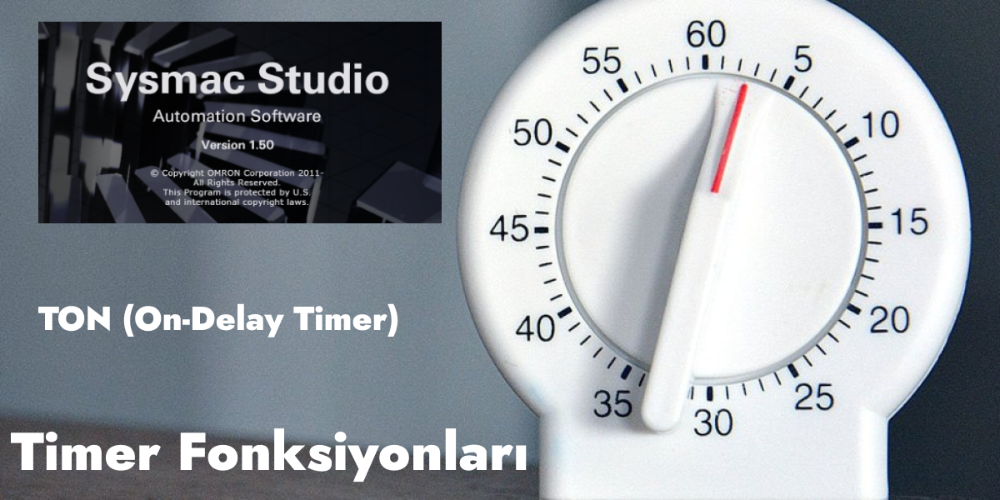
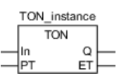
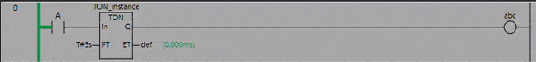
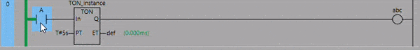
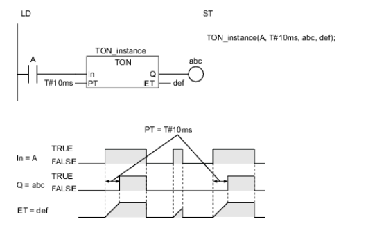

# Giriş

Sysmac Studio’daki Timer fonksiyonları, zamana bağlı işlemleri kontrol etmek amacıyla kullanılmaktadır. Örneğin belli şartlar sağlandıktan 2 saniye sonra bir çıkışın aktif edilmesini istiyorsak bir Timer fonksiyonu ile bu işlemi kolaylıkla yapabiliriz. 

Sysmac Studio’da 5 çeşit Timer Fonksiyonu bulunmaktadır. Bunlar;

- TON (On-Delay Timer)
- TOF (Off-Delay Timer)
- TP (Timer Pulse)
- AccumulationTimer
- Timer (Hundred-ms Timer)

## TON (On-Delay Timer)

**Ladder Diagram (LD) Olarak Gösterimi:** 



**Structured Text (ST) Olarak Gösterimi:**

```
TON_instance (In, PT, Q,ET);
```

| |  Giriş/Çıkış | Anlamı | Açıklama | Geçerli Aralık | Birim |
| --- | --- | --- | --- | --- | --- |
| In | Giriş | Timer Giriş | **TRUE** : Timer Başla  **FALSE** : Timer Dur | TRUE veya FALSE | — |
| PT | Giriş | Ayarlanan Zaman | Zamanlayıcının başlamasından Q çıkışının TRUE olarak değişmesine kadar geçen süre | T#0 ms to T#106751d_23h_47m_16s_854.775807ms | ms |
| Q | Çıkış | Timer Çıkış | **TRUE** : Timer çıkışı aktif  **FALSE** : Timer çıkışı pasif | TRUE yada FALSE | — |
| ET | Çıkış | Geçen Süre | Zamanlayıcı başladığından beri geçen süre | T#0 ms to T#106751d_23h_47m_16s_854.775807ms | ms |

***In*** girişi aktif edildikten ***PT*** girişine yazılan değer kadar sonra ***Q*** çıkışı aktif olmaktadır. Timer’ın hangi sürede olduğu ***ET*** çıkışından takip edilebilir.



Yukarıdaki GIF’te 5 saniyelik bir TON kullanılmıştır. ***A*** kontağı tetiklendikten 5 saniye sonra ***abc*** çıkışı aktif hale gelmiştir. TON Timer aktif olduktan sonra ne kadar zaman geçtiği ***def*** değişkeninden takip edilebilir. **A** kontağı FALSE hale geçtikten sonra **abc** çıkışı da FALSE olmuştur.

Peki ya 5 saniye tamamlanmadan ***A*** kontağı FALSE durumuna geçseydi ne olacaktı?



***A*** kontağı, ***def*** değişkeninden de görülebileceği gibi TON Timer’ın yaklaşık 4.saniyesinde FALSE durumuna geçmiştir. Bu durumda ***abc*** çıkışı hiç aktif olmamış ve ***def*** değişkeni sıfırlanarak TON Timer resetlenmiştir.

### Zamanlama Diyagramı

TON Timer, zamanlayıcı başladıktan sonra ayarlanan süre geçtiğinde TRUE verir. Zaman nanosaniye cinsinden ayarlanır.

***In*** girişi TRUE olduğunda TON Timer başlar. ***ET***, zaman geçtikçe artar.

***ET***, ayarlanan ***PT*** süresine ulaştığında, ***Q*** çıkışı TRUE olur. ***ET*** bundan sonra artırılmaz.

***In***, FALSE olduğunda TON Timer sıfırlanır. ***ET*** 0 olarak ve ***Q*** FALSE olarak değişir.

TON Timer başlatıldıktan sonra ***In*** FALSE olarak değişirse, TON Timer ***ET*** ***PT***'ye ulaşmadan önce sıfırlanır.

Aşağıdaki şekilde, T#10 ms'lik bir ***PT*** için bir programlama örneği ve zamanlama tablosu gösterilmektedir. ***A*** kontağı TRUE olarak değiştikten 10ms sonra ***abc*** çıkışı TRUE olarak değişecektir.



### Dikkat Edilecek Hususlar

- ***PT*** ye göre ***Q***'nun TRUE’ya geçtiği durumdaki zamanlama hatası -100 ns ile (100 ns + 1 task period)  arasındadır.
    
    Yukarıdaki aralık aşağıdakileri içerir:
    
    - ±100 ns, ***ET***'nin zamanlama hatasıdır.
    - Her görev periyodunda ***ET***’nin ***PT***’ye ulaşıp ulaşmadığı kontrol edilir. Kontrol tamamlandıktan hemen sonra ***ET, PT***’ye ulaşırsa, 1 task period kadar gecikme oluşur.
- Zaman, Sysmac Studio'da 0,001 ms'lik artışlarla görüntülenir, ancak zamanlama doğruluğu 1 ns'dir.
- ***In*** zaten TRUE ise, PLC Run’a geçer geçmez TON Timer çalışmaya başlar.
- ***PT*** T#0 ms veya negatif bir sayı ayarlanmışsa, ***In*** girişi TRUE olarak değişir değişmez ***Q*** çıkışı TRUE olarak değişecektir.
- ***In*** girişi TRUE iken ***PT*** değerini değiştirebilirsiniz. İşlem aşağıdaki gibidir:

| Timer Durumu | Q Değeri | PT'nin değiştirildikten sonraki değeri | İşlem |
| --- | --- | --- | --- |
| Zamanlama tamamlandıktan sonra | TRUE | — | Q değeri TRUE olarak kalır.ET'nin değeri de değişmez. Değiştirilmeden önceki PT değerinde kalır. |
| Zamanlama devam ediyor | FALSE | PT≥ ET | Timer devam eder. ET değeri PT değerine ulaştığında, Q çıkışı TRUE olarak değişir ve ET artık artırılmaz. |
| Zamanlama devam ediyor | FALSE | PT< ET | Q çıkışı hemen TRUE olarak değişir.Artan ET hemen durur. |
- Eğer PLC Resetlenirse ***ET*** değeri 0 olarak değişir ve ***Q*** çıkışı FALSE olarak değişir.
- Bu Timer Ladder Diagram’da kullanılırsa, aynı basamaktaki ve kendinden önce bulunan bir fonksiyonda hata meydana geldiğinde ***Q*** değeri ***FALSE*** olarak değişir.